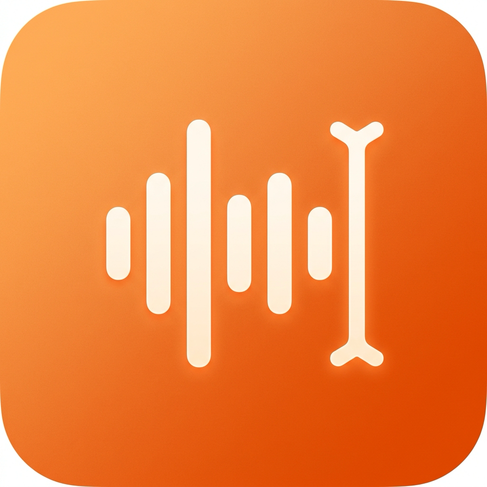
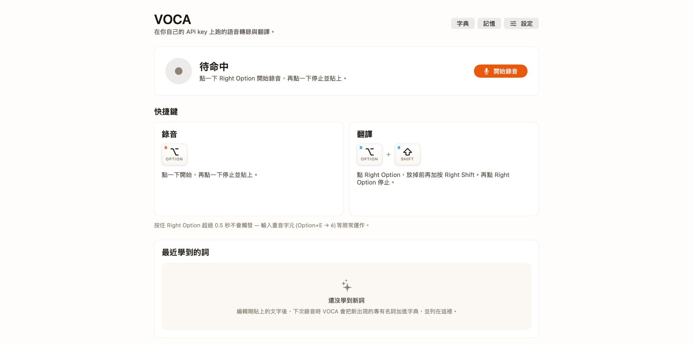

<div align="center">



# VOCA

**自帶金鑰（Bring-your-own-key）的 macOS 語音聽寫工具**

開口說話，乾淨的文字就落在游標處 —— 在任何 app 裡都行。<br/>
你的語音、你的 API 金鑰、你的資料。

[](#)
[](LICENSE)
[](https://github.com/will30-blockchain/voca/actions)

**繁體中文** · [English](README.en.md)

<br/>



</div>

VOCA 是一款原生的 macOS 選單列（menu-bar）聽寫與翻譯工具，靈感來自
Typeless，但建立在一個原則上：你自備 API 金鑰、自選市場上最快最便宜的
模型 —— 用多少付多少，沒有任何東西存在別人的伺服器上。

---

## 為什麼選 VOCA

- **自帶金鑰。** Groq、OpenAI、Anthropic、Deepgram —— 或用 Apple Speech
  完全離線。最便宜的組合每次聽寫只花不到一分錢。
- **潤飾，而非只是轉錄。** LLM 會去掉贅字、處理自我更正、把郵件排版成形，
  並把口說的列舉轉成真正的編號清單 —— 而且不無中生有。
- **會學習的字典。** 聽寫後立刻修正一個錯字，VOCA 就會悄悄把該詞加進字典
  （Typeless 風格），下次就會對。
- **一流的中文支援。** 繁簡感知、保留中英夾雜（code-switching），並在 CJK
  與英數之間自動加半形空格（用VOCA → 用 VOCA）。
- **邊說邊翻譯。** 用一種語言聽寫，貼上另一種語言的翻譯。
- **沉靜、原生的介面。** 貨真價實的選單列 app —— 沒有玻璃質感、沒有光暈、
  沒有 AI 味。只有溫暖的米白介面與 SF Pro。

## 功能特色

| 功能 | 說明 |
|---|---|
| 🎙 快捷鍵 | 點按 **右 Option** 開始／停止聽寫 |
| 🌐 翻譯 | 點按 **右 Option**，放開前再加按 **右 Shift** |
| 🔊 即時音量 | RMS 驅動的波形，讓你知道麥克風確實有收音 |
| ⌥ 潤飾 | LLM 清理標點、去除贅字、處理自我更正 |
| ✉️ 郵件排版 | 偵測到問候語 + 結尾署名時自動排成郵件格式 |
| 1️⃣ 清單 | 「第一點 / 第二點 / …」→ 真正的編號清單 |
| 📖 字典 | 詞彙表會偏引（bias）STT 與 LLM 編輯器；貼上後修正錯字時自動收錄專有名詞 |
| 🧠 記憶 | 追蹤高頻詞（≥ 2 次使用），加上自由格式的個人事實 |
| ✦ Pangu 空格 | 在 CJK 與英文／數字之間加半形空格（預設開啟） |
| ↻ 重試 | 流程中途網路中斷 → 音訊保留在緩衝區，點一下即可重試 |
| ⎋ ESC | 在任何地方按下都能取消進行中的錄音 |
| 📋 日誌 | 設定 → Logs 顯示每個流程步驟與各階段延遲 |

## 安裝

從 [Releases](https://github.com/will30-blockchain/voca/releases) 下載可直接
執行的 `.dmg` —— 不需要 Xcode。（想自己建置？見
[從原始碼建置](#從原始碼建置)。）

VOCA 目前是 **自簽章（self-signed）** —— 還沒有 Apple Developer ID 簽章，
所以 macOS Gatekeeper 不會讓你用一般雙擊開啟。下面是一次性的處理方式；移除
這道手續的計畫見 [發佈狀態](#發佈狀態)。

### 首次啟動 —— 通過 Gatekeeper

1. 開啟 `.dmg`，把 `VOCA.app` 拖進 `/Applications`。
2. 在「應用程式」資料夾中，**在 `VOCA.app` 上按右鍵（或 Control-click）→
   打開**。
3. 對話框會說 *「macOS 無法驗證 VOCA 的開發者」*。點 **打開** 就對了 ——
   這個按鈕只會在右鍵這條路徑出現。
4. 完成。之後 VOCA 就能用一般雙擊開啟；右鍵這一步每次安裝只需做一次。

> **出現「App 已損毀，無法打開」？** 那是下載時被加上了 quarantine 隔離標記。
> 執行一次以下指令清除，再重試右鍵開啟：
> ```bash
> xattr -dr com.apple.quarantine /Applications/VOCA.app
> ```
> 這只會移除隔離標記 —— 不會更動簽章、內容，或你已授予的任何權限。

### 授權權限與金鑰

1. **麥克風** —— 第一次按下快捷鍵時 macOS 會詢問。
2. **輔助使用（Accessibility）** —— 到 *系統設定 → 隱私權與安全性 →
   輔助使用*，把 VOCA 打開，然後 **結束並重新開啟**（⌘Q 後再開）。macOS 只在
   程式啟動時重新讀取輔助使用的信任狀態，所以沒重開的話開關不會生效。
3. **API 金鑰** —— 到 設定 → Providers，貼上你的 Groq 金鑰，可從
   <https://console.groq.com/keys> 取得。

接著點按右 Option、開口說、再點一下 —— 文字就落在游標處。

### 發佈狀態

| 路徑 | 狀態 |
|---|---|
| 從 GitHub Releases 取得自簽章 `.dmg`（右鍵 → 打開） | ✅ 目前方式 |
| Apple Developer ID 簽章 + 公證（雙擊即可乾淨開啟） | 🚧 規劃中，需要每年 $99 的 Apple Developer Program |
| Homebrew Cask | 🚧 規劃中，待 Developer ID 就緒後 |
| Mac App Store | ❌ 不規劃 —— App Sandbox 規則實質上禁止全域快捷鍵 + 輔助使用 |

右鍵這套手續只是因為缺少 Developer ID 才存在。一旦有了公證版本，一般雙擊就能
直接開啟。

## 從原始碼建置

給貢獻者，或想執行最新 `main` 的人。

先備條件：
- macOS 14 Sonoma 或更新版本
- Xcode 15+ 與 Swift 工具鏈
- 一組 Groq、OpenAI、Anthropic 或 Deepgram 的 API 金鑰（或使用離線的 Apple Speech）

```bash
git clone https://github.com/will30-blockchain/voca.git
cd voca
./scripts/setup-signing.sh   # 一次性：建立穩定的本機簽章憑證
./scripts/build-app.sh       # 建置 + 簽章 VOCA.app
open dist/VOCA.app
```

接著依照上方的 [授權權限與金鑰](#授權權限與金鑰) 完成設定。

### 建置腳本會動到你機器上的什麼

我們立場很硬：**VOCA 的建置流程絕不能弄壞你 Mac 上其他不相干的 app。**
具體來說，這裡的腳本：

- 持久化檔案 **只** 寫在專案的 `build/` 目錄裡。
- **不會** 碰你的登入 keychain 或其中任何密碼。
- **不會** 在 `~/Library/` 安裝任何東西。
- 在 `codesign` 呼叫期間會 *暫時* 修改使用者的 keychain 搜尋清單（macOS
  要求如此 —— 光靠 `--keychain` 不夠）。`build-app.sh` 攔截 `EXIT`、`INT`、
  `TERM`，**保證原本的搜尋清單會被還原** 才結束，即使失敗或被 Ctrl-C 中斷。
  淨效果：零持久性變更。

`setup-signing.sh` 會在 `build/voca-signing.keychain-db` 建立一個專案本地的
keychain，裡面只放一張自簽的開發憑證。要清除一切痕跡，執行
`./scripts/uninstall-signing.sh`。（它也會偵測並清理 2026-05 前舊版
`setup-signing.sh` 那個 *永久* 汙染使用者 keychain 搜尋清單的已知 bug ——
該 bug 現已修正。）

## 架構

兩個 Swift 套件。**`VOCACore`** 是純粹、不含 AppKit 的領域邏輯 —— 音訊擷取、
STT/LLM 供應商客戶端、潤飾、修正學習，以及 JSON 持久化。**`VOCA`** 則是
AppKit + SwiftUI 的選單列 app。整條流程 —— 錄音 → 轉錄 → 潤飾 → 注入 → 學習
—— 由 `VoiceTypeEngine` 統籌。

```
Sources/
  VOCACore/           Audio · Hotkeys · Transcription · LLM · Refinement ·
                      Learning · Memory · Dictionary · History · Logging ·
                      Settings · Util · Permissions · VoiceTypeEngine
  VOCA/               AppDelegate · MenuBar · Dashboard · HUD · Toast ·
                      Settings（7 個面板） · DesignTokens
Tests/VOCACoreTests/  純 Swift 單元測試
scripts/              setup-signing · build-app · uninstall-signing · make-icon
```

視覺語言沿用 SuperCard 的「Professional Warmth」（溫暖米白介面、品牌橘、
SF Pro）。完整設計筆記見 [`docs/ARCHITECTURE.md`](docs/ARCHITECTURE.md)；
自動學習的準確度藍圖見 [`docs/AUTO_LEARN_PLAN.md`](docs/AUTO_LEARN_PLAN.md)。

## 隱私

- 音訊不落地。錄下的 WAV 只存在記憶體中，直接送到你設定的供應商。
- v1 版本中，API 金鑰以明文存放於
  `~/Library/Application Support/VOCA/settings.json`。**Keychain 整合已列入
  藍圖。** 請把該檔案視為敏感資料。
- 其餘一切（字典、記憶、歷史、日誌）都只留在你的 Mac 本機。
- VOCA 絕不回傳資料。唯一的對外 HTTP 請求，只送往你選擇的供應商端點。

## 威脅模型

VOCA 設計上要防範什麼、不防範什麼，讓你判斷它是否適合你的使用情境：

**範圍內（我們在意）：**
- 你的 API 金鑰留在你的機器上。日誌在寫入磁碟前會依前綴（`sk-`、`sk-ant-`、
  `gsk_`、`AIza`）遮蔽，所以你在 bug 回報裡貼出的日誌片段不會外洩金鑰。
- 音訊不被保存。錄音只存在記憶體，收到回應後即釋放。
- 貼上的輸出只送到你按下快捷鍵時所在焦點的那個 app —— VOCA 不會切換焦點或
  切到背景。
- 除了你選的供應商端點外，沒有任何對外流量。沒有遙測、沒有當機回報器、
  二進位檔裡沒有任何分析 SDK。

**範圍外（我們不試圖防範）：**
- 你 Mac 上已在執行、且擁有相同使用者權限的惡意程式。若有惡意程式已取得
  輔助使用權限，不論有沒有 VOCA，它都能讀取你輸入的內容。
- 你所選供應商（Groq、OpenAI、Anthropic、Deepgram）看得到你聽寫的文字 ——
  這是使用遠端 STT/LLM 的必然結果。要完全離線請用 Apple Speech 供應商。
- 靜態磁碟加密。我們假設你的 Mac 已啟用 FileVault。

漏洞揭露請見 [SECURITY.md](SECURITY.md)。

## 開發藍圖

- [ ] Keychain 支援的 API 金鑰儲存
- [ ] 可自訂快捷鍵
- [ ] 串流即時逐字稿（Deepgram、OpenAI Realtime）
- [ ] 透過 `whisper.cpp` 的本地 Whisper，達成完全離線
- [ ] Homebrew Cask 上架
- [ ] 基於 Sparkle 的自動更新
- [ ] Windows 版本（`voca-windows`）

## 參與貢獻

歡迎 PR。請見 [`CONTRIBUTING.md`](CONTRIBUTING.md)。較大的變更請先開一個 issue
討論做法。參與即表示你同意我們的 [行為準則](CODE_OF_CONDUCT.md)。

## 贊助開發

VOCA 是利用業餘時間打造與維護的。如果它為你省下時間或打字的痛苦，歡迎小額
贊助 —— 這能支付偶爾的 Apple Developer Program 費用、咖啡，以及測試時用掉的
API 額度。

**以太坊 / EVM**（可用於 Mainnet、Polygon、BSC、Arbitrum、Base 等）：

```
0x081540Eb4c21B8Be8a652d408A4711bFaffeB5f4
```

其他事宜，請來信 **valley.mirror7602@eagereverest.com**。

## 致謝

VOCA 是與 [Claude Code](https://claude.com/claude-code) 協作打造的 ——
架構、設計決策，以及大部分實作，都是透過與 Claude 的結對程式設計反覆打磨出來
的。這個產品在使用者層面並不是一個「AI app」；它是一個剛好會呼叫你所選 AI
API 的語音打字工具。

「Professional Warmth」視覺語言與 [SuperCard](https://github.com/will30-blockchain)
系列 app 共用，而「先寫、再修、然後學習」的 UX 則取法自
[Typeless](https://typeless.io/)。

## 授權條款

MIT —— 見 [`LICENSE`](LICENSE)。
