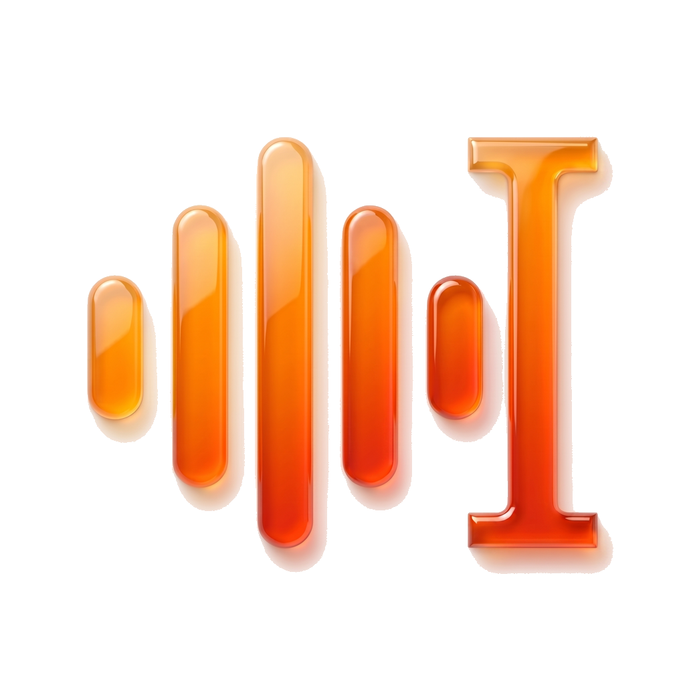
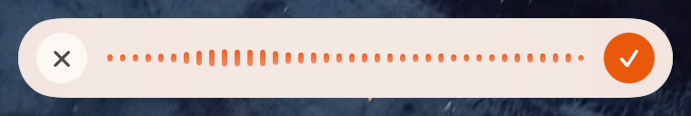

<div align="center">



# VOCA

**自訂 API 的 macOS 語音聽寫工具**

說話即可將轉錄文字插入游標位置，適用於任何應用程式。<br/>
語音資料、API 金鑰與使用紀錄皆保留於本機。

[](#)
[](LICENSE)
[](https://github.com/will30-blockchain/voca/actions)

**繁體中文** · [English](README.en.md)

<br/>



<br/><br/>


</div>

VOCA 是一款原生的 macOS 選單列聽寫與翻譯工具。使用者可自行設定 API 供應商與
模型，依實際用量計費，語音資料直接傳送至指定供應商，不經過中介伺服器。

---

## 為什麼用 VOCA

- **自訂 API。** 支援 Groq、OpenAI、Anthropic、Deepgram，亦可使用 Apple Speech
  完全離線運作。最經濟的組合每次聽寫成本不到一分錢。
- **智慧字典優化。** 聽寫後隨手修正的錯字會自動記錄，下次輸出即套用正確寫法。
- **中文優化。** 正確區分繁簡、保留中英夾雜原文，並於中英文與數字之間自動加入
  半形空格。
- **格式自動識別。** 偵測問候語與署名後排版為 email，將口語條列整理為編號清單，
  並移除口頭禪、處理語句修正。
- **即時翻譯。** 以來源語言口述，輸出為指定的目標語言文字。
- **原生介面。** 標準選單列應用程式，介面設計未採用玻璃擬態或光暈等視覺效果。

## 功能一覽

| 功能 | 說明 |
|---|---|
| 快捷鍵 | 按一下右 Option 開始或結束聽寫 |
| 翻譯 | 按右 Option 後、放開前補按右 Shift，觸發翻譯輸出 |
| 即時音量 | 顯示即時波形，反映麥克風收音狀態 |
| 潤稿 | 由 LLM 補上標點符號、移除贅字並處理語句修正 |
| 自動排信 | 偵測問候語與署名後自動排版為 email 格式 |
| 清單 | 將口語條列（如「第一點、第二點」）自動轉為編號清單 |
| 字典 | 字典詞彙同時作用於 STT 與 LLM；貼上後修改的專有名詞會自動收錄 |
| 記憶 | 記錄常用詞彙，使用兩次以上自動收錄，亦支援手動新增個人資訊 |
| Pangu 空格 | 中英文與數字間自動加入半形空格，預設啟用 |
| 重試 | 連線中斷時保留錄音，可點擊重新執行 |
| ESC | 聽寫過程中可隨處按 ESC 取消 |
| 日誌 | 於 設定 → Logs 檢視每個流程步驟與各階段耗時 |

## 安裝

自 [Releases](https://github.com/will30-blockchain/voca/releases) 下載可直接執行
的 `.dmg`，無需安裝 Xcode。如需自行建置，請參閱 [從原始碼建置](#從原始碼建置)。

VOCA 目前採用自簽章，尚未取得 Apple Developer ID，因此 macOS Gatekeeper 不會
允許直接以雙擊開啟。以下為一次性的處理步驟；關於此限制的移除規劃，請見
[發佈狀態](#發佈狀態)。

### 首次開啟，繞過 Gatekeeper

1. 開啟 `.dmg`，將 `VOCA.app` 拖曳至 `/Applications`。
2. 於「應用程式」資料夾中對 `VOCA.app` 按右鍵，選擇「打開」。
3. 出現「macOS 無法驗證開發者」提示時，點選「打開」即可。此按鈕僅於右鍵操作時
   出現。
4. 完成後即可正常以雙擊開啟；右鍵操作於每次安裝僅需執行一次。

> **若出現「App 已損毀，無法打開」**：此為下載時系統加上的隔離標記所致。於終端
> 機執行以下指令清除後，再依上述步驟以右鍵開啟：
> ```bash
> xattr -dr com.apple.quarantine /Applications/VOCA.app
> ```
> 此指令僅移除隔離標記，不影響簽章、內容或已授予的權限。

### 授權權限與金鑰

1. **麥克風**：首次觸發快捷鍵時，系統將提示授權。
2. **輔助使用**：於 系統設定 → 隱私權與安全性 → 輔助使用 中啟用 VOCA，並
   重新啟動應用程式。macOS 僅於啟動時讀取此權限，未重啟則不會生效。
3. **API 金鑰**：於 設定 → Providers 貼上 API 金鑰，Groq 金鑰可於
   <https://console.groq.com/keys> 取得。

設定完成後，按右 Option 開始聽寫，再次按下即結束，文字將輸出至游標位置。

### 發佈狀態

| 方式 | 狀態 |
|---|---|
| 從 GitHub Releases 下載自簽章 `.dmg`，右鍵開啟 | 目前提供 |
| Apple Developer ID 簽章與公證，支援雙擊開啟 | 規劃中，需每年 $99 美元的 Apple Developer Program 費用 |
| Homebrew Cask | 規劃中，待 Developer ID 就緒後進行 |
| Mac App Store | 不予規劃，App Sandbox 規則基本上不允許全域快捷鍵與輔助使用 |

右鍵操作僅因缺少 Developer ID 而存在。待公證版本推出後，即可直接雙擊開啟。

## 從原始碼建置

供貢獻程式碼或執行最新 `main` 分支使用。

事前準備：
- macOS 14 Sonoma 以上
- Xcode 15+ 與 Swift 工具鏈
- 一組 Groq、OpenAI、Anthropic 或 Deepgram 的 API 金鑰，或使用離線的 Apple Speech

```bash
git clone https://github.com/will30-blockchain/voca.git
cd voca
./scripts/setup-signing.sh   # 一次性：建立穩定的本機簽章憑證
./scripts/build-app.sh       # 建置並簽章 VOCA.app
open dist/VOCA.app
```

建置完成後，依上方 [授權權限與金鑰](#授權權限與金鑰) 完成設定。

### 建置腳本涉及的系統變更

建置流程遵循以下原則：**不得影響系統上其他應用程式。** 具體措施如下：

- 所有寫入檔案僅限於專案 `build/` 目錄。
- 不存取使用者登入 keychain 或其中的密碼。
- 不於 `~/Library/` 安裝任何項目。
- 執行 `codesign` 時，因 macOS 要求，會暫時修改使用者的 keychain 搜尋清單
  （僅提供 `--keychain` 參數不足以滿足需求）。`build-app.sh` 攔截 `EXIT`、
  `INT`、`TERM` 訊號，確保清單於結束時還原，即使中途失敗或以 Ctrl-C 中斷
  亦同。

`setup-signing.sh` 於 `build/voca-signing.keychain-db` 建立專屬於本專案的
keychain，內含一張自簽開發憑證。執行 `./scripts/uninstall-signing.sh` 可完整
移除。此指令同時會偵測並清除 2026 年 5 月前舊版腳本遺留的問題（該版本會永久
汙染使用者 keychain 搜尋清單），現已修正。

## 架構

分為兩個 Swift 套件。`VOCACore` 為純邏輯層，不依賴 AppKit，涵蓋收音、STT/LLM
供應商串接、潤稿、修正學習與 JSON 儲存。`VOCA` 則為以 AppKit 與 SwiftUI 開發的
選單列應用程式。整體流程（錄音、轉錄、潤稿、貼上、學習）由 `VoiceTypeEngine`
統籌。

```
Sources/
  VOCACore/           Audio · Hotkeys · Transcription · LLM · Refinement ·
                      Learning · Memory · Dictionary · History · Logging ·
                      Settings · Util · Permissions · VoiceTypeEngine
  VOCA/               AppDelegate · MenuBar · Dashboard · HUD · Toast ·
                      Settings（7 個面板） · DesignTokens
Tests/VOCACoreTests/  純 Swift 單元測試
scripts/              setup-signing · build-app · uninstall-signing · make-icon
```

視覺設計延續 SuperCard 系列的「Professional Warmth」風格，採用暖白底色、
品牌橘與 SF Pro 字體。完整設計說明見
[`docs/ARCHITECTURE.md`](docs/ARCHITECTURE.md)，自動學習準確度規劃見
[`docs/AUTO_LEARN_PLAN.md`](docs/AUTO_LEARN_PLAN.md)。

## 隱私

- 語音資料不寫入磁碟，錄製的 WAV 檔案僅存於記憶體中，直接傳送至指定的
  供應商。
- API 金鑰儲存於 macOS Keychain，不會寫入設定檔。在自簽章版本上，首次讀取
  各金鑰時 macOS 會詢問一次「VOCA 想使用鑰匙圈」，選擇「總是允許」後即不再
  提示；待取得 Developer ID 與公證後將完全靜默。
- 設定、字典、記憶、歷史紀錄與日誌等其他資料，皆僅儲存於使用者本機。
- VOCA 不會傳送任何未經告知的資料，唯一的對外連線為使用者選定的供應商。

## 威脅模型

以下說明 VOCA 的防護範圍，供評估是否符合使用需求。

防護範圍內：
- API 金鑰僅保存於本機。寫入日誌前會依前綴（`sk-`、`sk-ant-`、`gsk_`、`AIza`）
  遮蔽，因此於錯誤回報中貼上的日誌片段不會洩漏金鑰。
- 語音不予保存。錄音僅存於記憶體，取得回應後即釋放。
- 輸出文字僅進入觸發快捷鍵當下的前景應用程式，VOCA 不會切換視窗或跳至背景。
- 除選定的供應商外，無任何對外連線。不含遙測、當機回報或分析 SDK。

防護範圍外：
- 已在系統上執行、且具備相同使用者權限的惡意程式。若其取得輔助使用權限，無論
  是否使用 VOCA，皆可讀取鍵盤輸入。
- 選定的供應商（Groq、OpenAI、Anthropic、Deepgram）將可見口述內容，此為使用
  遠端 STT/LLM 的必然結果。如需完全離線，請使用 Apple Speech。
- 硬碟靜態加密不在防護範圍內，預設使用者已啟用 FileVault。

如需回報漏洞，請見 [SECURITY.md](SECURITY.md)。

## 開發藍圖

- [x] 以 Keychain 儲存 API 金鑰
- [ ] 可自訂快捷鍵
- [ ] 串流即時逐字稿（Deepgram、OpenAI Realtime）
- [ ] 透過 `whisper.cpp` 執行本地 Whisper，實現完全離線
- [ ] 上架 Homebrew Cask
- [ ] Sparkle 自動更新
- [ ] Windows 版本 `voca-windows`

## 參與貢獻

歡迎提交 PR，詳細規範見 [`CONTRIBUTING.md`](CONTRIBUTING.md)。重大變更建議
先開 issue 討論方向。參與本專案即表示同意遵守
[行為準則](CODE_OF_CONDUCT.md)。

## 贊助開發

VOCA 由開發者於業餘時間開發與維護。如認為本工具有實質幫助，歡迎小額贊助，
用於支應 Apple Developer 費用與測試所需的 API 額度。

支援 Ethereum / EVM 相容鏈，包含 Mainnet、Polygon、BSC、Arbitrum、Base：

```
0x081540Eb4c21B8Be8a652d408A4711bFaffeB5f4
```

如有其他事宜，請來信 **valley.mirror7602@eagereverest.com**。

## 致謝

VOCA 由 **Superdigital 超速雲端科技股份有限公司**與 **Wilson Chen** 開發與
維護，架構、設計決策與大部分實作透過與
[Claude Code](https://claude.com/claude-code) 的結對程式設計反覆打磨而成。

視覺設計參照 Superdigital 系列應用程式的品牌設計語言。

## 授權條款

採用 MIT 授權，詳見 [`LICENSE`](LICENSE)。
